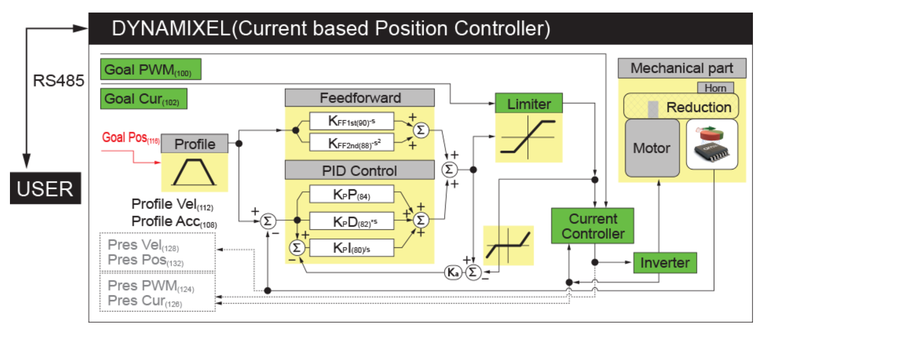

# Dynamixel-Torque-Control

This project involves developing a Torque based Position PID Controller. Dynamixel Smart Actuators are used to build a basic Planar 2R Robot arm to implement Cartesian space motion.

### Torque Control Architecture 

### Torque Based Position PID Control Architecture

