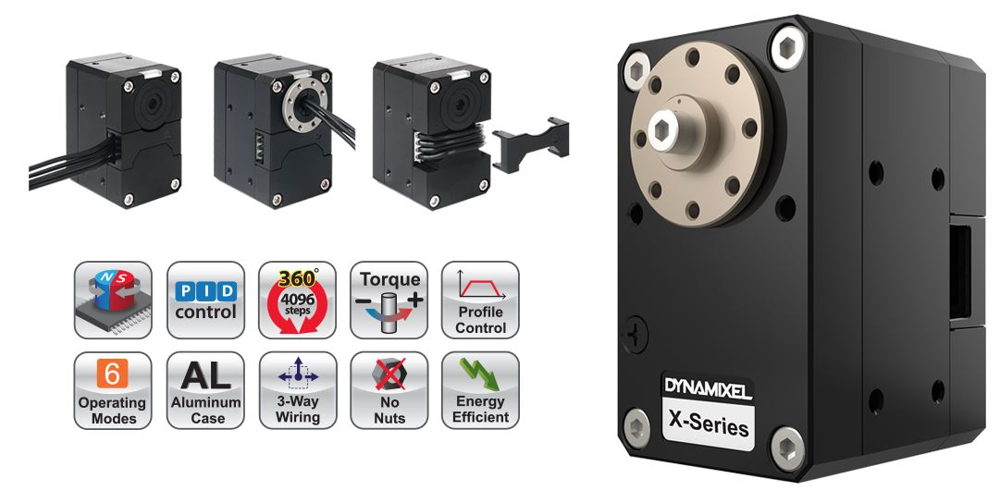

# Dynamixel-Torque-Control
Torque control on a smart actuator. Dynamixel XH540 W270-R

DYNAMIXEL

The DYNAMIXEL is a smart actuator system developed to be the exclusive connecting joints on a robot or mechanical structure. DYNAMIXELS’ are designed to be modular and daisy chained on any robot or mechanical design for powerful and flexible robotic movements. The DYNAMIXEL is a high performance actuator with a fully integrated DC (Direct Current) Motor + Reduction Gearhead + Controller + Driver + Network, all in one servo module actuator. 
Programmable and networkable, actuator status can be read and monitored through a data packet stream. 

Basic Features
▪ Improved Torque, Compact Size
▪ Enhanced Durability and Expandability
▪ Hollow Back Case Minimizes Cable Stress (3-way-routing)
▪ Direct Screw Assembly to the Case (without Nut Insert)
▪ Improved Heat Sink Featuring an Aluminum Case

Various Control Functions
▪ 6 Operating Modes
▪ Current-Based Torque Control (4096 steps, 2.69mA/step)
▪ Profile Control for Smooth Motion Planning
▪ Trajectory Data and Moving Status (In-Position, Following Error, etc.)
▪ Energy Saving (Reduced Current from 100mA to 40mA)

Sophisticated Control Architecture
▪ Various feedback and control method according to developers’ needs
▪ Protocol 2.0 provides reliable packet communication

